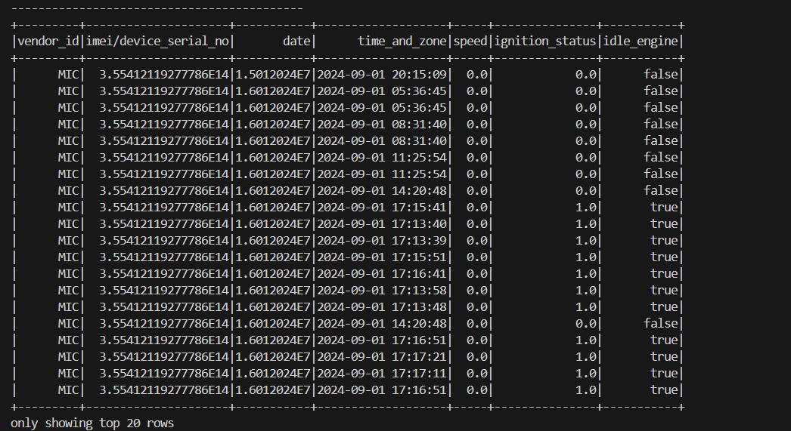
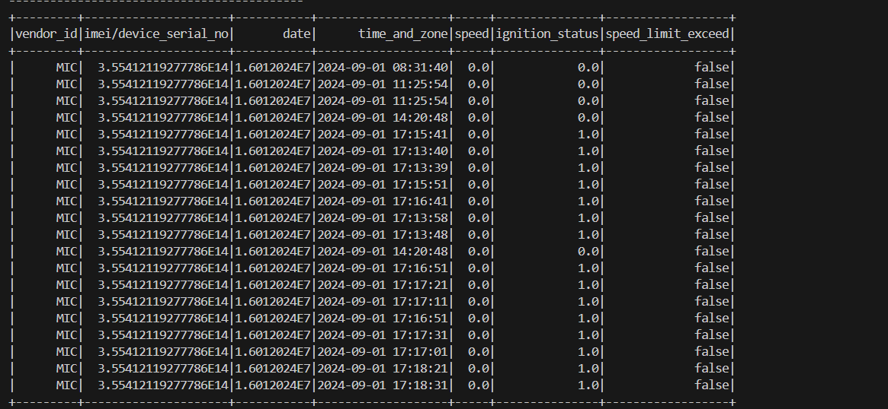
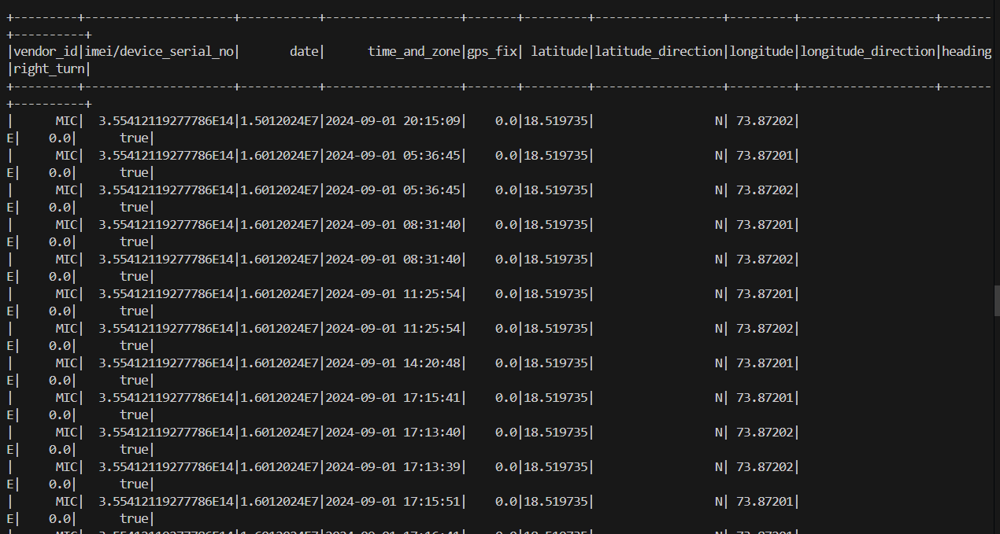
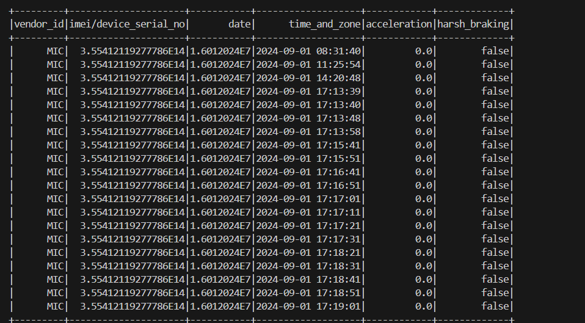

#TelematicsStream 

This project explains how telematics data is streamed from Kafka topics to S3 or delta lake using PySpark streaming

Architecture:

Fig: Architecture 

Whole this process can be orchestrated through Airflow.

Outputs:
Idle Engine:

Speed limit exceed:

Right Turn:

Harsh breaking:

Storages:
